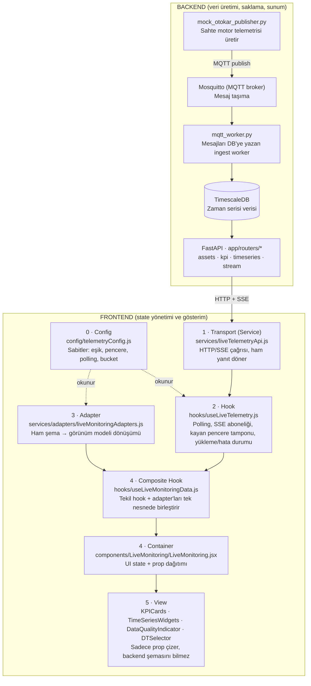

# Mimari Genel Bakış

Bu doküman, canlı motor telemetrisinin backend'de üretilip saklanmasından, frontend'de arayüzde çizilmesine kadarki veri akışını ve her katmanın sorumluluğunu özetler. Ayrıntılı geliştirme reçeteleri için `README-INTEGRATION.md` ve `FRONTEND-ARCHITECTURE.md` dosyalarına bakın.

Sistem, 12 motorun telemetrisini (`temperature`, `vibration`, `speed`) gerçek zamanlı toplayıp izleyen bir dijital ikiz izleme uygulamasıdır. Şu an yalnızca **Live Monitoring** modülü gerçek backend'e bağlıdır; diğer modüller (PdM, TPT, Platform, System Settings, ESOGU DT) mock veriyle çalışır.

---

## Uçtan Uca Akış Şeması

Veri akışı tek yönlüdür: **Backend (üret → taşı → sakla → sun) → Service → Hook → Adapter → Composite → Container → View.** Hiçbir View bileşeni bu sırayı atlayıp doğrudan backend'e istek atmaz.

---

## Backend Sorumlulukları

| Bileşen | Dosya | Görev |
|---|---|---|
| Mock üreteç | `tools/mock_otokar_publisher.py` | Gerçek motor yokken telemetriyi taklit eder, MQTT'ye yayınlar |
| Broker | Mosquitto | MQTT mesajlarını taşır (port 1883) |
| Ingest worker | `app/ingest/mqtt_worker.py` | MQTT mesajlarını okuyup TimescaleDB'ye yazar |
| Veritabanı | TimescaleDB (`cbmdtm`) | Zaman serisi ölçümlerini ve continuous aggregate'leri saklar |
| API / Router | `app/routers/*.py` | Veritabanı verisini HTTP/SSE uç noktaları olarak sunar |

**Router = backend'in bir uç noktası (endpoint) + gelen isteğe verilecek yanıt.** Her router dosyası bir kapıdır:

| Router | Uç nokta | Döndürdüğü |
|---|---|---|
| `assets.py` | `GET /api/v1/assets` | Tüm motorların listesi (UUID ↔ `MOTOR_XX` eşlemesi için). Filtresiz; tabloyu tam çeker |
| `kpi.py` | `GET /api/v1/kpi/live` | Canlı KPI'lar (lag p95, gap rate, ihlal, event count, kalite %) |
| `timeseries.py` | `GET /api/v1/timeseries` | Tarihsel seri (raw / 1m / 10m / 1h bucket) |
| `stream.py` | `GET /api/v1/stream/telemetry` | SSE ile canlı telemetri akışı |

---

## Frontend Katmanları

Gösterim (arayüzde çizim) tamamen frontend'in işidir; backend yalnızca ham JSON döndürür.

| # | Katman | Dosya | Sorumluluk | Ne zaman değişir |
|---|---|---|---|---|
| 0 | Config | `config/telemetryConfig.js` | Sabitleri tutar (eşik, pencere, polling sıklığı, bucket kuralı). İş yapmaz, okunur | Bir ayar/eşik değişince |
| 1 | Transport (Service) | `services/liveTelemetryApi.js` | Backend'i çağırır, ham yanıtı döndürür. Veri **tutmaz**, dönüştürmez | Endpoint/adres değişince |
| 2 | Hook | `hooks/useLiveTelemetry.js` | Service'i tekrar tekrar çağırır; polling, SSE aboneliği, kayan pencere tamponu, yükleme/hata durumu. Veriyi **tutan ve tazeleyen** katman | Yeni veri deseni gerekince |
| 3 | Adapter | `services/adapters/liveMonitoringAdapters.js` | Ham backend şemasını (ör. `ingest_lag_p95_ms`) görünüm modeline dönüştürür (normalizasyon) | Backend şeması değişince (yalnızca burası) |
| 4 | Composite / Container | `hooks/useLiveMonitoringData.js`, `components/LiveMonitoring/LiveMonitoring.jsx` | Tekil hook + adapter çıktısını birleştirir; UI state'i yönetir; bileşenlere prop dağıtır | Modülün veri ihtiyacı / panel değişince |
| 5 | View | `components/LiveMonitoring/*.jsx` | Yalnızca prop'u çizer; backend şemasını bilmez. `liveMode` bayrağıyla canlı/mock seçer | Görsel değişiklikte |

### Service ile Hook ayrımı

`Service` anlıktır ve hafızasızdır: çağrılınca bir kez veri getirir ve döner. `Hook` ise zaman ve hafıza katmanıdır: service'i belirli aralıklarla çağırır (polling), SSE bağlantısını açık tutar, gelen ölçümleri hafızada kayan pencerede biriktirir ve veri değişince arayüzü yeniden çizmeyi tetikler.

### Config'in kapsamı

`telemetryConfig.js` genel ve Live Monitoring'e ait sabitleri tutar; ihtiyaç duyan katman (çoğunlukla hook ve adapter) `import` ederek okur. Bir modüle **özgü** sabit gerektiğinde (ör. PdM canlıya bağlanırken) ayrı bir dosya açılır: `config/pdmConfig.js`.

---

## Temel Kurallar

1. View bileşenleri asla doğrudan `axios`/`fetch` çağırmaz; her çağrı `liveTelemetryApi.js`'ten geçer.
2. Backend alan adları yalnızca adapter dosyasında bilinir; View bunları görmez.
3. Sabit değerler bileşene yazılmaz, config dosyasına konur.
4. Mock yolu silinmez, koşullandırılır: `liveMode ? liveProp : mockData`. Böylece backend kapalıyken de arayüz gezilebilir.
5. SSE kontratı sabittir: `{ asset_id, signal_id, ts, value, quality }`. UUID ↔ kod eşlemesi katalog uç noktalarından (`/api/v1/assets`, `/api/v1/signals`) yapılır.
